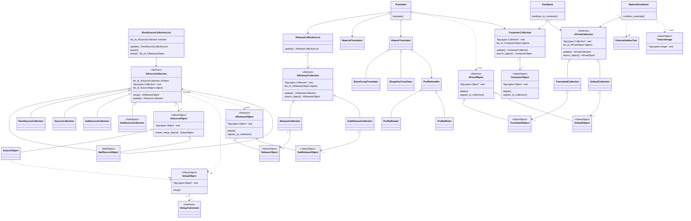

```mermaid
    classDiagram
        RootSourceCollectionList o--> ASourceCollection

        ASourceCollection o-->"recursively" ASourceCollection

        ASourceCollection <|-- RootSourceCollection

        ASourceCollection <|-- SourceCollection

        ASourceCollection <|-- SubSourceCollection

        ASourceCollection <|-- NullSourceCollection

        ASourceCollection "1"o-->"1..*" ASourceObject

        ASourceCollection ..>"use" SetupObject

        SetupObject "0..*"o-->"1..*" ISetupCommand

        ASourceObject <|-- SourceObject

        ASourceObject <|-- NullSourceObject

        SourceObject ..>"create" SetupObject

        ReleaseCollectionList "1"o-->"1..*" AReleaseCollection

        AReleaseCollection <|-- ReleaseCollection
        ReleaseCollection "1"o-->"1..*" ReleaseObject

        AReleaseCollection <|-- SubReleaseCollection
        SubReleaseCollection "1"o-->"1..*" SubReleaseObject

        ASourceCollection ..>"create" AReleaseObject

        AReleaseObject <|-- ReleaseObject
        AReleaseObject <|-- SubReleaseObject

        Translator o--> ReleaseCollectionList
        Translator o--> MaterialTranslator
        Translator o--> ANameTranslator
        Translator ..>"create" AFinalObject

        ANameTranslator <|-- BoneGroupTranslator
        ANameTranslator <|-- ShapeKeyTranslator

        ANameTranslator o--> ProfileHandler

        ProfileHandler <|-- ProfileReader
        ProfileHandler <|-- ProfileWriter

        ContainerCollection "1"o-->"1..*" ContainerObject
        Translator o--> ContainerCollection

        AFinalObject <|-- TranslatedObject
        AFinalObject <|-- DefaultObject

        TranslatedCollection "1"o-->"1..*" TranslatedObject
        DefaultCollection "1"o-->"1..*" DefaultObject
        
        Feedback o--> ContainerCollection
        Feedback o--> AFinalCollection

        AFinalCollection <|-- TranslatedCollection
        AFinalCollection <|-- DefaultCollection

        MaterialCombiner "1"o-->"1..2" AFinalCollection
        MaterialCombiner ..>"use" ExternalAddonTool
        MaterialCombiner "1"..>"1..* create" TextureImage

        class RootSourceCollectionList
            RootSourceCollectionList: list_of_ASourceCollection  member
            RootSourceCollectionList: update() RootSourceCollectionList
            RootSourceCollectionList: queue()
            RootSourceCollectionList: setup() list_of_AReleaseObject

        class ASourceCollection
            <<Abstract>> ASourceCollection
            ASourceCollection: list_of_ASourceCollection children
            ASourceCollection: "bpy.types.Collection" -real
            ASourceCollection: list_of_SourceObject objects
            ASourceCollection: setup() AReleaseObject
            ASourceCollection: update() ASourceCollection

        class ASourceObject
            <<ValueObject>> ASourceObject
            ASourceObject: "bpy.types.Object" -real
            ASourceObject: create_setup_object() SetupObject

        class SetupObject
            <<ValueObject>> SetupObject
            SetupObject: "bpy.types.Object" -real
            SetupObject: setup()

        class ISetupCommand
            <<Interface>> ISetupCommand

        class AReleaseObject
            <<Abstract>> AReleaseObject
            AReleaseObject: "bpy.types.Object" -real
            AReleaseObject: delete()
            AReleaseObject: register_to_collection()

        class AReleaseCollection
            <<Abstract>> AReleaseCollection
            AReleaseCollection: "bpy.types.Collection" -real
            AReleaseCollection: list_of_AReleaseObject objects
            AReleaseCollection: update() AReleaseCollection
            AReleaseCollection: search_object() AReleaseObject

        class ReleaseCollectionList
            ReleaseCollectionList
            ReleaseCollectionList: update() ReleaseCollectionList

        class NullSourceCollection
            <<NullObject>> NullSourceCollection
        
        class NullSourceObject
            <<NullObject>> NullSourceObject

        class ReleaseObject
            <<ValueObject>> ReleaseObject

        class SubReleaseObject
            <<ValueObject>> SubReleaseObject

        class TranslatedObject
            <<ValueObject>> TranslatedObject

        class DefaultObject
            <<ValueObject>> DefaultObject

        class ContainerObject
            <<ValueObject>> ContainerObject
            ContainerObject: "bpy.types.Object" -real
            ContainerObject: delete()
            ContainerObject: register_to_collection()

        class TextureImage
            <<ValueObject>> TextureImage
            TextureImage: " bpy.types.Image" -real

        class AFinalCollection
            <<Abstract>> AFinalCollection
            AFinalCollection: "bpy.types.Collection" -real
            AFinalCollection: list_of_AFinalObject objects
            AFinalCollection: update() AFinalCollection
            AFinalCollection: search_object() AFinalObject


        class Translator
            Translator: translate()

        class MaterialCombiner
            MaterialCombiner: combine_materials()

        class Feedback
            Feedback: feedback_to_container()

        class ContainerCollection
            ContainerCollection: "bpy.types.Collection" -real
            ContainerCollection: list_of_ContainerObject objects
            ContainerCollection: update() ContainerCollection
            ContainerCollection: search_object() ContainerObject

        class AFinalObject
            <<Abstract>> AFinalObject
            AFinalObject: "bpy.types.Object" -real
            AFinalObject: delete()
            AFinalObject: register_to_collection()

```