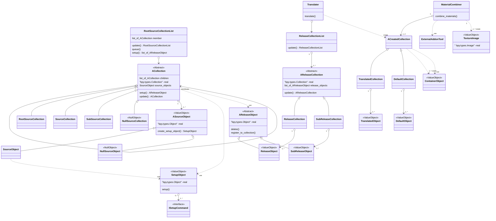

```mermaid
    classDiagram
        class RootSourceCollectionList
            RootSourceCollectionList: list_of_ACollection  member
            RootSourceCollectionList: update() RootSourceCollectionList
            RootSourceCollectionList: queue()
            RootSourceCollectionList: setup() list_of_AReleaseObject

        class ACollection
            <<Abstract>> ACollection
            ACollection: list_of_ACollection children
            ACollection: "bpy.types.Collection" -real
            ACollection: SourceObject source_objects
            ACollection: setup() AReleaseObject
            ACollection: update() ACollection

        class ASourceObject
            <<ValueObject>> ASourceObject
            ASourceObject: "bpy.types.Object" -real
            ASourceObject: create_setup_object() SetupObject

        class SetupObject
            <<ValueObject>> SetupObject
            SetupObject: "bpy.types.Object" -real
            SetupObject: setup()

        class ISetupCommand
            <<Interface>> ISetupCommand

        class AReleaseObject
            <<Abstract>> AReleaseObject
            AReleaseObject: "bpy.types.Object" -real
            AReleaseObject: delete()
            AReleaseObject: register_to_collection()

        class AReleaseCollection
            <<Abstract>> AReleaseCollection
            AReleaseCollection: "bpy.types.Collection" -real
            AReleaseCollection: list_of_AReleaseObject release_objects
            AReleaseCollection: update() AReleaseCollection

        class ReleaseCollectionList
            ReleaseCollectionList
            ReleaseCollectionList: update() ReleaseCollectionList

        class NullSourceCollection
            <<NullObject>> NullSourceCollection
        
        class NullSourceObject
            <<NullObject>> NullSourceObject

        class ReleaseObject
            <<ValueObject>> ReleaseObject

        class SubReleaseObject
            <<ValueObject>> SubReleaseObject

        class TranslatedObject
            <<ValueObject>> TranslatedObject

        class DefaultObject
            <<ValueObject>> DefaultObject

        class ContainerObject
            <<ValueObject>> ContainerObject

        class TextureImage
            <<ValueObject>> TextureImage
            TextureImage: " bpy.types.Image" -real

        RootSourceCollectionList o--> ACollection

        ACollection o-->"recursively" ACollection

        ACollection <|-- RootSourceCollection

        ACollection <|-- SourceCollection

        ACollection <|-- SubSourceCollection

        ACollection <|-- NullSourceCollection

        ACollection "1"o-->"1..*" ASourceObject

        ACollection ..>"use" SetupObject

        SetupObject "0..*"o-->"1..*" ISetupCommand

        ASourceObject <|-- SourceObject

        ASourceObject <|-- NullSourceObject

        SourceObject ..>"create" SetupObject

        ReleaseCollectionList "1"o-->"1..*" AReleaseCollection

        AReleaseCollection <|-- ReleaseCollection
        ReleaseCollection "1"o-->"1..*" ReleaseObject

        AReleaseCollection <|-- SubReleaseCollection
        SubReleaseCollection "1"o-->"1..*" SubReleaseObject

        ACollection ..>"use" AReleaseObject

        AReleaseObject <|-- ReleaseObject
        AReleaseObject <|-- SubReleaseObject

        Translater o--> ReleaseCollectionList
        Translater ..>"create" ACreatedCollection

        MaterialCombiner "1"o-->"1..2" ACreatedCollection
        MaterialCombiner ..>"use" ExternalAddonTool
        MaterialCombiner "1"..>"1..* create" TextureImage

        class Translater
            Translater: translate()

        class MaterialCombiner
            MaterialCombiner: combine_materials()

        ACreatedCollection <|-- TranslatedCollection
        ACreatedCollection <|-- DefaultCollection

        ACreatedCollection ..>"1..* create" ContainerObject
        ACreatedCollection ..>"use" ContainerObject

        TranslatedCollection "1"o-->"1..*" TranslatedObject
        DefaultCollection "1"o-->"1..*" DefaultObject 
```