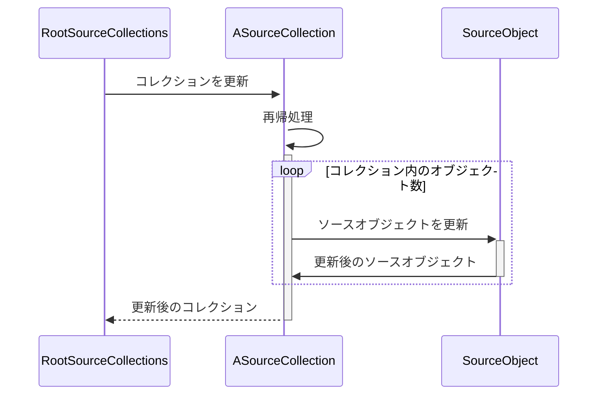

```mermaid
    sequenceDiagram
    participant roots as RootSourceCollections
    participant src as ASourceCollection
    participant srcobj as SourceObject
    roots ->>+ src: コレクションを更新
    src ->>+ src: 再帰処理
    loop コレクション内のオブジェクト数
        src ->>+ srcobj: ソースオブジェクトを更新
        srcobj ->>- src: 更新後のソースオブジェクト
    end
    src -->>- roots : 更新後のコレクション
```