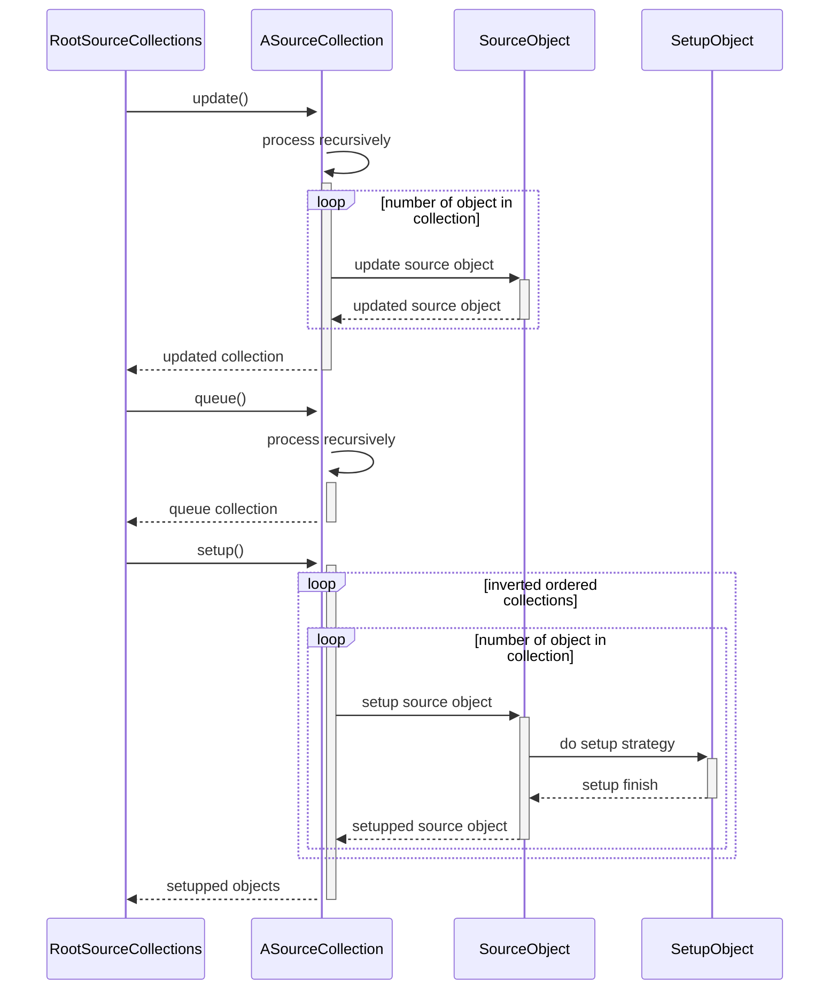

```mermaid
    sequenceDiagram
    participant roots as RootSourceCollections
    participant src as ASourceCollection
    participant srcobj as SourceObject
    participant suobj as SetupObject
    roots ->>+ src: update()
    src ->>+ src: process recursively
    loop number of object in collection
        src ->>+ srcobj: update source object
        srcobj -->>- src: updated source object
    end
    src -->>- roots : updated collection

    roots ->>+ src: queue()
    src ->>+ src: process recursively
    src -->>- roots : queue collection

    roots ->>+ src: setup()
    loop inverted ordered collections
        loop number of object in collection
            src ->>+ srcobj: setup source object
            srcobj ->>+ suobj: do setup strategy
            suobj -->>- srcobj: setup finish
            srcobj -->>- src: setupped source object
        end
    end
    src -->>- roots : setupped objects
```